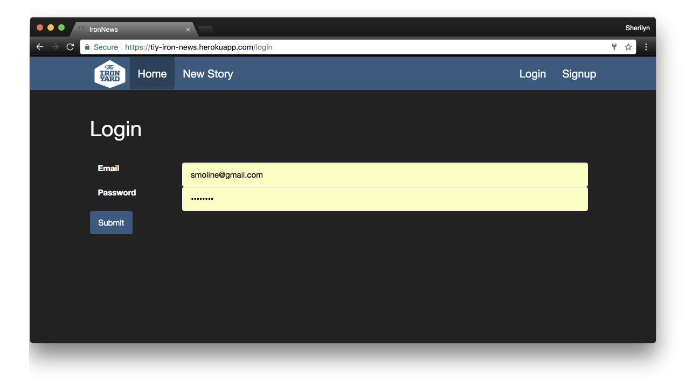

# Iron News with Authentication via Bcrypt

See this app here: https://tiy-iron-news.herokuapp.com/

## This app is built with Rails 5.0 and Ruby 2.4

## This repo is a continuation of the Iron News App

* Users have been added to the system using bcrypt based user authentication
* Implemented sign up, login, logout
* Added an acknowledgement that the user is logged in on the navbar
* Tracking which user created a story
* Only users that are logged in may post a new story
* Only the user that created a story may edit or delete it
* Users that are not logged in may still see the stories on the index url
* This app tracks which user created a comment
* Added the ability to edit/destroy a comment but only if the logged in user was the author

